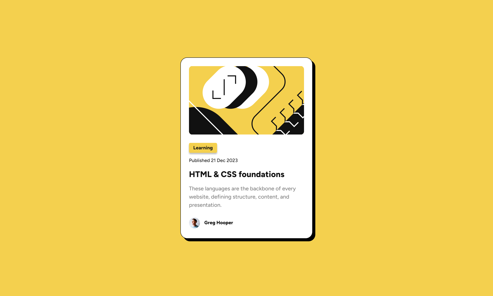

# Frontend Mentor - Blog preview card solution

This is a solution to the [Blog preview card challenge on Frontend Mentor](https://www.frontendmentor.io/challenges/blog-preview-card-ckPaj01IcS). Frontend Mentor challenges help you improve your coding skills by building realistic projects.

## Table of contents

- [Overview](#overview)
  - [The challenge](#the-challenge)
  - [Screenshot](#screenshot)
  - [Links](#links)
- [My process](#my-process)
  - [Built with](#built-with)
  - [Useful resources](#useful-resources)
- [Author](#author)

**Note: Delete this note and update the table of contents based on what sections you keep.**

## Overview

### The challenge

Users should be able to:

- See hover and focus states for all interactive elements on the page

### Screenshot

### Links

- Solution URL: [View Code](https://github.com/moojica/frontend-mentor-blog-preview-cardm)
- Live Site URL: [View Site](https://moojica.github.io/frontend-mentor-blog-preview-card/)

## My process

### Built with

- Flexbox
- CSS custom properties
- Semantic HTML5 markup
- Mobile-first workflow

### Useful resources

- [A Complete Guide to Flexbox](https://css-tricks.com/snippets/css/a-guide-to-flexbox/) - This is an amazing article which helped me understand Flexbox. I'd recommend it to anyone still learning this concept.
- [For more information on using drop-shadow](https://developer.mozilla.org/en-US/docs/Web/CSS/filter-function/drop-shadow) - MDN docs are always useful for learning new concepts or simply just referring back for syntax help.

## Author

- Frontend Mentor - [@moojica](https://www.frontendmentor.io/profile/moojica)
